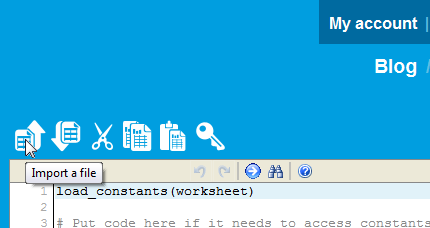
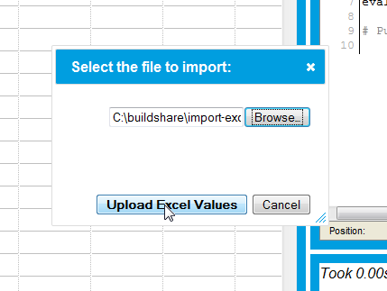
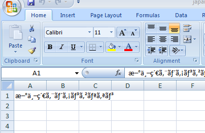
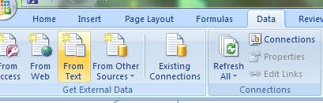
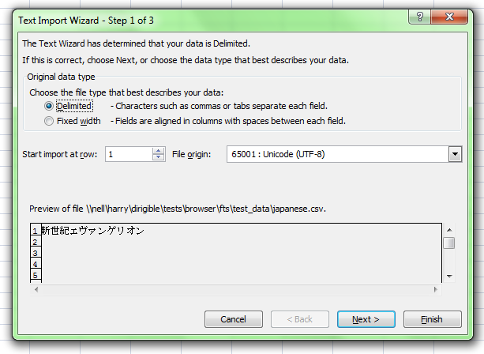
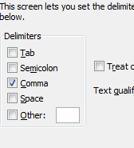
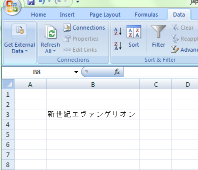

Importing and Exporting
=======================

We're keen to help you get data in and out of Dirigible. We currently support:

 * Import from Microsoft Excel (values only, no formulae yet)

 * Import from CSV (in Excel format or international format)

 * Export to CSV (Excel and international)

Import from Excel
^^^^^^^^^^^^^^^^^

You can import Excel workbooks into Dirigible. Currently only values are
imported and only Excel versions up to 2003 are supported. Charts, macros,
pictures, embedded objects, Visual Basic modules, formulae, comments and
hyperlinks are ignored.

To import an Excel spreadsheet, click on the 'Import a file' button in the toolbar of a Dirigible sheet:

You will be presented with a dialog where you can select a file to import:

When you select 'Upload Excel Values', you will be returned to your dashboard
page. Each of the sheets in the Excel workbook (except empty ones) will be imported
as a new Dirigible sheet and automatically added to your list of sheets. Their
names are based on the filename of the file you uploaded and the name of the
sheet in the Excel workbook.

Dates and Times
---------------
Dates and times in the Excel workbook will be converted to Dirigible DateTime
objects.

These behave exactly like Python `datetime.datetime
<http://docs.python.org/library/datetime.html#datetime.datetime>`_ objects.

Import from CSV
^^^^^^^^^^^^^^^

CSV or "comma-separated values" is a popular format for encoding tabular data in a text file.

    http://en.wikipedia.org/wiki/Comma-separated_values

If you're looking to get data in from Excel, you may want to take a look at our
Import from Excel option first - aside from anything else, it can handle doing
more than one sheet at a time. If you're looking to import data from a database
or similar, you'll probably find there's an option to export to CSV, and you'll
then be able to import it into Dirigible.

You'll find the import icon on the tool bar of a Dirigible sheet.  Select a CSV
file from your PC, and you'll get the option to upload it.  The data will be
pasted into your sheet at the current selected cell position (this lets you
import new data inside of a sheet you've already started work on but
**be warned**, it will overwrite any data that's below and to the right of your
current cursor position.

.. image:: import_export_import_csv_options.jpg

A brief word on the difference between "Excel-encoded" and "international"
CSVs.  (Here, we're talking about the way text characters are encoded
in the file, not the syntax of how to delimit fields and quoting.

Excel-encoded CSVs
------------------

Excel uses the Windows-1252_ encoding, which, despite being predicatably
incompatible with ISO standards, does at least handle most western
european characters.  This is our default setting for imports, and you'll
probably find that, due to the popularity of Excel, most CSVs you find lying
around will be encoded in this format.  We recommend you try this first.

Other encodings
---------------

If you've tried importing your CSV in Excel format and you found some of
your characters are garbled, then you've probably got a CSV file that's encoded
according to a different standard, like unicode_. This might be because it
contains some non-western characters, or perhaps because it was produced by
people who actually follow standards...  Either
way, there's a good chance you can still import it into Dirigible using our
**auto-detect** mode, which is based on chardet_.  Give it a try, but be warned
that if your file *was* encoded in Excel format, auto-detect will get it wrong,
so always try Excel first.

.. _Windows-1252: http://en.wikipedia.org/wiki/Windows-1252
.. _chardet: http://chardet.feedparser.org/
.. _unicode: http://chardet.feedparser.org/

Export to CSV
-------------

If you want to get your data out of Dirigible and into a desktop application, you'll
probably find there's an option to import data from CSV in it.  Industry
leading spreadsheet applications such as Microsoft Excel
certainly offer you the option of opening CSV files

    http://en.wikipedia.org/wiki/Comma-separated_values

The dirigible Export menu gives you two options:

Download for Excel (default)
----------------------------

Try this option first - it will produce a Windows-1252_ encoded
CSV file which Excel, and any other applications that are likely to want to be
compatible with Excel, can read.

Download as international (utf8-encoded) CSV
--------------------------------------------

Try this if you run into any problems.  UTF-8 is a flavour of unicode_, and
without going into the gory details, it should be able to handle pretty much
any kind of characters. However if you try and import a UTF-8 encoded file into
Excel, you'll probably find Excel gets it all wrong.  But don't despair,
there's a workaround:

.. _resolver_one:

Help! my CSV file is all garbled when I open it in Excel!
^^^^^^^^^^^^^^^^^^^^^^^^^^^^^^^^^^^^^^^^^^^^^^^^^^^^^^^^^

The problem you've run into is that Excel automatically assumes that CSV files
are encoded with Microsoft's unilaterally imposed Windows-1252_ encoding, which
can't handle half the world's characters.  But don't despair, Excel does have a
workaround, the `Text import wizard
<http://office.microsoft.com/en-us/excel-help/text-import-wizard-HP010102244.aspx>`_

- Find the text import wizard via **Data --> Get External Data**

- Select **Delimited**
- Under **File Origin**, choose **65001: Unicode (UTF-8)**

- Cick **Next**
- Tick the **comma** character

And you're good to go!

(We love Excel really)

