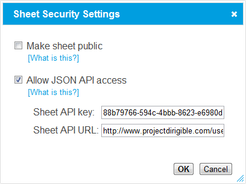

The JSON API
============

A JSON API is a URL which sends back a chunk of textual data in the `JSON
format <http://www.json.org/>`_. These can be used by third party applications,
including scripts you write yourself, to access and manipulate your Dirigible
sheets over the internet.

Accessing Dirigible Sheets
--------------------------

Each sheet can be accessed as JSON, in either a GET or POST request. The URL
to retrieve a sheet's cell values is::

    http://SHEET_URL/v0.1/json/?api_key=API_KEY

Where SHEET_URL is the URL of the sheet on the dirigible installation, i.e::

    localhost:8000/user/USERNAME/sheet/SHEET_ID

To enable a sheet's JSON access and find out your sheet's API_KEY, open the
sheet page in a browser and click the sheet's security settings button, in the
toolbar above the usercode editor.

.. image:: security-dialog-button.png

This will display a dialog:

Click the appropriate checkbox to enable JSON access. A random API key will be
generated for the sheet. You may change this if you wish, for example to deny
access to third parties who have discovered the API key for this sheet.

When sending requests for the sheet content, pass the API key as a
parameter (each sheet has a different API key)::

    http://SHEET_URL/v0.1/json?api-key=API_KEY

This is the URL that is provided in the 'Sheet API URL' field in the dialog.

Overriding Cell Values
----------------------

As well as retrieving cell values, the JSON API can override the formulae of
cells.

This allows you to set up a sheet to perform a calculation, and then have
an application use the JSON API to provide alternative input values and
retrieve the new results after the sheet is recalculated.

Pass the cell overrides as either GET or POST parameters::

    http://SHEET_URL/v0.1/json?CELL=FORMULA

CELL
    specifies a cell location, in any of the formats 'A2', 'a2', or '1,2'.

FORMULA
    is any value you might enter as a cell formula, such as '42'::

        http://SHEET_URL/v0.1/json?A2=42

    Or you may pass a cell formula, starting with an equals. These
    formulae, like all GET and POST parameters, need to be URL
    encoded. For example, setting cell B3 to '=c2+2' in a GET request
    ends up looking like:

        http://SHEET_URL/v0.1/json?b3=%3DC1%2B2

    %3D is '='; %2B is '+'

Several cell overrides may be composed in a single request, eg::

    http://SHEET_URL/v0.1/json?a2=123&b3=456

These overrides are transient and local to the request. No other requests
for the sheet will see their effects.

