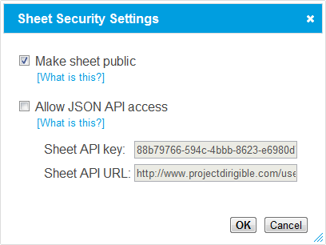

Making sheets public
====================

Dirigible allows you to make any of your sheets public.  A public sheet can be seen and copied
-- but not changed -- by anyone, including people who aren't logged in to Dirigible,
so it's a great way to share your work without worrying about other people breaking things.

To make a sheet public, go to the sheet page's and click the security settings button, in the
toolbar above the usercode editor.

This will display a dialog:

Check the "Make sheet public", and click OK.

Other people use the same URL to view your sheets as you do to view and change them,
so if you want to send someone a link, just use the contents of your browser's address bar.
