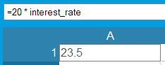
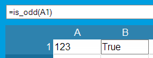
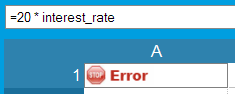
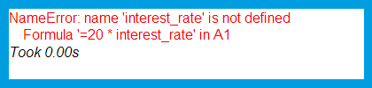
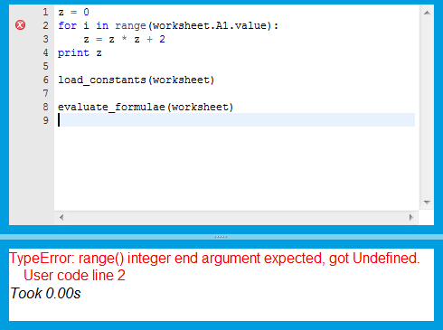

Tutorial part 2: Getting more control of your spreadsheet with usercode
=======================================================================

This section of the tutorial explains more about the usercode - the area
of source code to the right of the grid. We'll show how to decide whereabouts
in the usercode you should make your own changes, and how you can restructure
the usercode to perform tasks like goal-seeking.

We strongly recommend that you create your own sheet by working through
this tutorial.

The anatomy of usercode
-----------------------

When you first create a sheet, it contains the following usercode::

    load_constants(worksheet)

    # Put code here if it needs to access constants in the spreadsheet
    # and to be accessed by cell formulae.  Examples: imports,
    # user-defined functions and classes you want to use in cells.

    evaluate_formulae(worksheet)

    # Put code here if it needs to access the results of cell formulae.

This code is written in `Python <http://python.org>`_, and it gets executed
every time you make a change to your sheet. In order to understand its
operation, we need to quickly revisit the humble spreadsheet cell.

A cell has two attributes: its *formula*, which is what gets set when you type
something into the cell. Also, it has a *value*, which is what is displayed
on-screen in the grid.

The function call :func:`load_constants` populates the displayed values in
every cell containing a *constant* - that is, a formula which consists of
a number or text which isn't prefixed by an '=' character.

The second function call, :func:`evaluate_formulae`, populates all the
remaining cells - the ones containing a formula that begins with '='. It
does this by *evaluating* the formula, and putting the result into the cell's
value.

As we'll see, this has implications for whereabouts in the usercode we should
place the following types of changes.

Defining values for use in cell formulae
----------------------------------------

As you saw in the previous tutorial, usercode can define values or functions
for use in cell formulae::

    load_constants(worksheet)

    interest_rate = 1.175

    def is_odd(n):
        if n % 2 == 0:
            return False
        else:
            return True

    evaluate_formulae(worksheet)

Importantly, notice how both the value *interest_rate* and the function
*is_odd* are defined before the call to :func:`evaluate_formulae`. As a
consequence, we can use *interest_rate* in cell formulae:

and we can use the function *is_odd* in cell formulae:

However, if we move the definition of either to a point after the call to
:func:`evaluate_formulae()`::

    load_constants(worksheet)

    evaluate_formulae(worksheet)

    interest_rate = 1.175

then trying to use *interest_rate* in cell formulae will now cause an error:

This is because while the formula in cell A1 is being evaluated (inside the
call to :func:`evaluate_formulae`), *interest_rate* has not yet been
defined.

Similarly, symbols and functions can be imported from the `Python standard
library <http://docs.python.org/library/index.html>`_. If you intend to use
them in your cell formulae though, the import must be placed before the call
the :func:`evaluate_formulae`. For example::

    load_constants(worksheet)

    from math import cos, pi

    evaluate_formulae(worksheet)

The value *pi* and the function *cos* can now be used in cell formulae.

Using cell values in usercode
-----------------------------

Previously we have seen that objects must be defined in usercode before
the call to :func:`evaluate_formulae` if we are to use them in cell formulae.

Conversely, sometimes we want to write usercode which uses values from cells.
In this case, we must be sure to position such usercode *after* the call to
:func:`evaluate_formulae`.

Imagine our usercode contained a formula that should be executed several
times, and cell A1 contained the number of times it should repeat.

**Put the value 4 into cell A1**, then add the following usercode::

    z = 0
    for i in range(worksheet.A1.value):
        z = z * z + 2
    print z

    load_constants(worksheet)

    evaluate_formulae(worksheet)

This will cause an error in the usercode:

Worksheet.A1.value is Undefined, because when we try to access it,
we haven't yet called either of the functions that
populate cell values.

Lets move the for-loop to after :func:`load_constants`::

    load_constants(worksheet)

    z = 0
    for i in range(worksheet.A1.value):
        z = z * z + 2
    print z

    evaluate_formulae(worksheet)

Click away from the usercode editor (e.g. on a cell) to save these changes
and recalculate the sheet.

This will now print the correct result '1446' in the output pane, on the bottom
right. This is because the constant value of '4' in cell A1 is populated by the
call to :func:`load_constants`. Then, after that is done, we can use the value
of cell A1 in our usercode.

Let's try something else. **Change the value in A1 from '4' to '=4'** (without quotes).

Now we get the error in our usercode again. This happens because our usercode
is trying to use the value in cell A1, but this cell's value is no longer set
by :func:`load_constants`. Because A1 now contains a formula instead of a
constant, its value is now set by :func:`evaluate_formulae`.

In order to make the usercode work, we have to move the for-loop to after
:func:`evaluate_formulae`::

    load_constants(worksheet)

    evaluate_formulae(worksheet)

    z = 0
    for i in range(worksheet.A1.value):
        z = z * z + 2
    print z

This produces the correct result '1446' in the output pane again.

Goal Seeking
------------

Here's a more advanced example. To demonstrate goal-seeking, we're going
to create a simple retirement planning spreadsheet which calls
:func:`evaluate_formula` several times, tweaking the spreadsheet
input cell values each time, until it finds a desireable outcome.

Let's start off by providing our spreadsheet with some inputs. Enter
the following values:

==== ====================================== =======
 \     A                                      B
==== ====================================== =======
  1   INPUTS:
---- -------------------------------------- -------
  2   Current age                              28
---- -------------------------------------- -------
  3   Desired retirement age                   50
---- -------------------------------------- -------
  4   Max monthly savings                    1500
---- -------------------------------------- -------
  5   Expected monthly retirement expenses   2500
---- -------------------------------------- -------
  6
---- -------------------------------------- -------
  7   Expected inflation                     0.065
---- -------------------------------------- -------
  8   Expected returns                       0.075
==== ====================================== =======

We're going define a function in the usercode, that will be used from cell
formula. Add this right before the call to :func:`evaluate_formulae`::

    # A simple FV calculator
    def future_value(interest_rate, number_payments, payment_amount):
        return (
            payment_amount *
            ((interest_rate + 1) ** number_payments - 1) /
            interest_rate
        )

Next up, let's label some cells for the spreadsheet outputs:

==== ===================================== ==========================================
 \     A                                     B
==== ===================================== ==========================================
 14   OUTPUTS:
---- ------------------------------------- ------------------------------------------
 15   How much you need to save per month
---- ------------------------------------- ------------------------------------------
 16   Cash generated by these savings       =future_value(B8/12, (B17-B2) * 12, B15)
---- ------------------------------------- ------------------------------------------
 17   Actual retirement age
==== ===================================== ==========================================

These two empty outputs, amount to save and actual retirement age, will be
used in the remainder of our calculations, so for now lets add some usercode
to populate them with reasonable initial values. Add this right after
the *future_value* function::

    # default values for amount to save
    worksheet.b15.value = worksheet.b4.value
    # default value for actual retirement age
    worksheet.b17.value = worksheet.b3.value

This will populate cells B15 and B17.

Now lets add more cell formula inbetween the inputs and the outputs, to
calculate some intermediate values:

==== ==================================== ==================================
 \     A                                    B
==== ==================================== ==================================
 10   WORKING:
---- ------------------------------------ ----------------------------------
 11   Yearly expenses at retirement        =B5 * (1 + B7) ** (B17 - B2) * 12
---- ------------------------------------ ----------------------------------
 12   Amount required for annuity          =B11 / B8
==== ==================================== ==================================

Cell B11 calculates our inflation-adjusted annual expenditure at
retirement, using the 'actual retirement age' we just defined in B17.
Cell B12 shows the size of investment we'll need in order to generate an
annuity that large.

These calculations expose a problem with our plan. The amount required
to generate our desired annuity (B12) comes out to around 1,598,000. However,
the estimated value of our savings at that time (B16) is only 1,003,000.
Something is going to have to give.

Let's write some usercode to find an optimal solution.

Increasing the retirement age
.............................

Let's **replace** the call to :func:`evaluate_formulae` with something a
little smarter::

    def have_enough():
        return worksheet.b16.value >= worksheet.b12.value

    # populate output cells with initial values
    evaluate_formulae(worksheet)

    # If we don't have enough then we're going to have to increase
    # the retirement age and try again
    while not have_enough():
        worksheet.b17.value += 1
        evaluate_formulae(worksheet)

Click away from the usercode editor (e.g. on a cell) to save these changes
and recalculate the sheet.

Here we've defined a function *have_enough*, that returns true if our
savings at retirement equal or exceed the amount we'll need to generate
our desired annuity.

Then we call :func:`evaluate_formulae` once, to seed the output cells with
initial values.

Finally, we use we a Python *while-loop* to repeatedly evaluate the cell
formula until *have_enough* returns True, increasing the actual retirement
age by one year every time.

This reveals, by the resulting value in cell B17, that the current plan will
require us to wait until age 75 before we can retire on the income we
desire.

Let's adjust our expectations then, to prepare for a more frugal future.
**Decrease the expected monthly retirement expenses** in cell B5, to 1400.
The actual retirement age (B17) now goes down to 50 - exactly as we desired
(B3).

Decreasing the amount saved
...........................

Our investment at retirement (B16=1,003,000) is now substantially larger than
the amount we need to generate our annuity (B12=895,000.) So we're saving more
than we need to. Can we find out how much we could reduce our monthly savings
by, and still make our retirement goal?

Add the following usercode, between the single call to
:func:`evaluate_formulae` and the final while loop::

    # Use a binary chop to find the amount to save per month
    # if it's less than the maximum
    def bin_chop(minimum, maximum):
        worksheet.b15.value = minimum
        evaluate_formulae(worksheet)
        if have_enough():
            return

        worksheet.b15.value = maximum
        evaluate_formulae(worksheet)
        if not have_enough():
            return

        # It's somewhere between the min and the max
        if (maximum - minimum) <= 1:
            # Close enough, let's bail out.
            return

        half = (maximum - minimum) / 2
        bin_chop(minimum, minimum + half)
        if have_enough():
            return

        bin_chop(minimum + half, maximum)
    bin_chop(0, worksheet.b4.value)

Click away from the usercode editor (e.g. on a cell) to save these changes
and recalculate the sheet.

This code defines a function, *bin_chop*, that is given a minimum and maximum
amount to save. It uses a binary search to find the minimum amount
needed to save until we *have_enough*. We then call this function in the
final line of the above snippet, passing a minimum of 0 and a maximum of
the user's desired maximum savings from B4. This reveals that to meet our
retirement goals, the amount we need to save, in B15, need be only 1339.

In conclusion
-------------

In this part of the tutorial, we've shown that the usercode is executed to
generate the results displayed in your spreadsheet. The functions it calls,
:func:`load_constants` and :func:`evaluate_formulae`, populate the values of
cells based upon the cell's values. We've examined the implications this has
for whereabouts in the usercode you should place your own custom usercode. This
depends on whether it needs access to cell values, or provides values and
symbols for cells. Finally, we showed a more advanced example of usercode,
which calls :func:`evaluate_formulae` several times until a goal is found.

In :doc:`the next part of the tutorial <tutorial03>`, we'll show how you can
use the Python `NumPy <http://numpy.scipy.org/>`_ library along with
Dirigible's ability to store Python objects in the spreadsheet grid, to build
simple spreadsheets that process large amounts of data without copying and
pasting formulae thousands of times.

