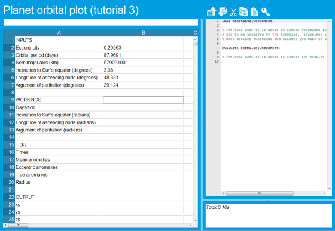
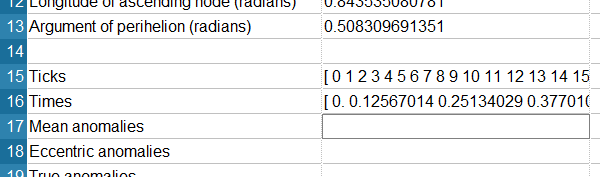
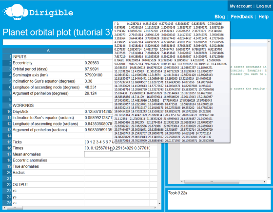
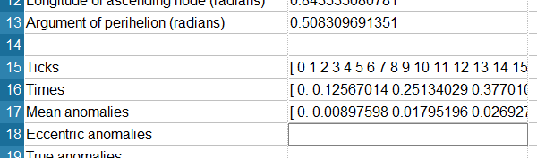
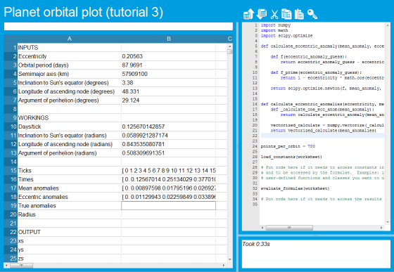
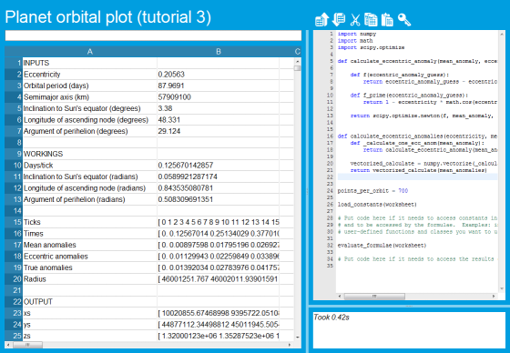

Tutorial part 3: Dealing with lots of data, using NumPy and objects in the grid
===============================================================================

One of Dirigible's greatest strengths is that cells in the spreadsheet grid aren't limited to holding numbers or text; each and every cell can hold any kind of Python object.  What this means is that one cell can contain an essentially unlimited amount of data, which can then be processed in bulk by your formulae -- meaning less duplication and easier maintenance.

This part of the tutorial introduces you to the Python `NumPy <http://numpy.scipy.org/>`_ library, a great source of numerical and statistical functions, and shows how you can build a useful spreadsheet where certain cells hold large arrays of numbers.

We strongly recommend that you create your own sheet by working through this tutorial.

Loading some basic data
^^^^^^^^^^^^^^^^^^^^^^^

The spreadsheet we're going to build will take some basic input values that describe the orbit of `the planet Mercury <http://en.wikipedia.org/wiki/Mercury_%28planet%29>`_.  It will use these to calculate a set of four 700-element arrays that give *x*, *y*, *z* and time coordinates that describe a single orbit of the planet around the Sun.  We won't go into the details of orbital mechanics, but will just give the formulae that you'll need to enter -- if you're keen on finding out more about the underlying mathematics, we recommend this page on `How to Calculate the Positions of the Planets <http://www.davidcolarusso.com/astro/>`_ and, if you're using a WebGL-capable browser like Chrome 9 or Firefox 4.0, `this WebGL tool <http://dl.dropbox.com/u/13551192/astrodynamics101/orbit.html>`_.

The very first step is to get some basic data into the spreadsheet.  We need values for the orbit's eccentricity (how close it is to being a perfect circle), the orbital period (the number of days for one complete orbit), the semimajor axis (a measure of the orbit's diameter), the inclination to the Sun's equator (the tilt of the orbit), and two terms that describe how the orbit is oriented with respect to the Sun's equator, known as the longitude of the ascending note and the argument of perihelion.  To save the time it would take to type these in manually, you can `download a comma-separated value file from here <https://s3.amazonaws.com/planet-data/mercury.csv>`_.  Once you've downloaded the the file to your machine, create a new sheet in Dirigible and click the import CSV button to import it:

Upload the new file, adjust the width of column A so that you can read everything, and give the sheet a name -- you'll end up with something like this:

The next step is to get started with some formulae.

Simple formulae
^^^^^^^^^^^^^^^

Before we create the powerful NumPy formulae that work with arrays of data, we'll need to create a few simple ones and a bit of usercode.  Put the following at the start of the usercode:

::

    import math

    points_per_orbit = 700

The first of these lines is just because we're going to need the Python ``math`` library in a moment; the second, as you might expect, is because we're going to plot 700 points around Mercury's orbital path.  This means that when we create arrays of data later, each array will have 700 points.

Next, we need to work out how many days (or more accurately, what portion of a day) will elapse for each "tick" of an imaginary clock that ticks once for each of those points.  This value will be extremely useful later; to calculate it, put the following formula into cell B10: ``=B3 / points_per_orbit``.

There are three more simple conversions we need to do before we get on to the interesting stuff.  The various angles that are specified in the orbital parameters at the top of the sheet are all specified in human-friendly degrees -- we need to convert them into math-friendly radians.  To do that, enter the following formulae:

* In B11, put ``=math.radians(B5)``
* In B12, put ``=math.radians(B6)``
* In B13, put ``=math.radians(B7)``

You'll wind up with something that looks like this:

.. image:: tutorial-03-before-numpy.png

So, that's the dull bit done: on to the NumPy arrays!

NumPy arrays in the grid
^^^^^^^^^^^^^^^^^^^^^^^^

As our starting point, let's create a NumPy array with one element for each tick.  To do that, add code to import NumPy to the start of your usercode:

::

    import numpy

...and then put the following formula into cell B15: ``=numpy.arange(points_per_orbit)``.  This will create a NumPy array containing the values 0, 1, 2, ... *points_per_orbit* - 1.  Dirigible will display it like this:

.. image:: tutorial-03-numpy-arange.png

The next step is to find out what time it will be (in terms of days) when our imaginary clock reaches each tick.  For example, as there are about 0.12 days per tick, on the second tick the time will be 0.24 days.  To put it another way, we want an array that contains the values in the range that we created in cell B15, all multiplied by the days/tick value we put into cell B10.  The formula for that is just ``=B15 * B10``, so put that in cell B16.  The result should look like this:

Of course, you can only see the first few values in the array -- but if you leave the mouse pointer "hovering" over the cell, you'll see a bubble help window with many more of them.

It's worth reiterating what we've just done; with a simple formula, we've transformed a 700-element array into another one with different values, by applying the same function to each.  The NumPy library makes this easy to do in Python, and Dirigible makes it work inside a spreadsheet grid.

The next formula is similar in form; in order to calculate the *x*, *y* and *z* values, we need something called a `mean anomaly <http://en.wikipedia.org/wiki/Mean_anomaly>`_ at each point around the orbit.  The formula for this is again simple in form, and again involves creating a complete array of values: ``=(2 * math.pi * B16) / B3`` should go into B17.

SciPy, Newton-Raphson and transcendental equations
^^^^^^^^^^^^^^^^^^^^^^^^^^^^^^^^^^^^^^^^^^^^^^^^^^

Our next step is a little more complex.  We want to work out the `eccentric anomaly <http://en.wikipedia.org/wiki/Eccentric_anomaly>`_ for each point in the orbit, but this is hard.  The equation that relates the mean anomaly *M*, the eccentric anomaly *E*, and the eccentricity *c* is this:

::

    M = E - c * sin E

If you can't see how to rearrange that so that it tells you how to get *E*, given values for *M* and *c*, you're not alone. The equation is `transcendental <http://en.wikipedia.org/wiki/Transcendental_equation>`_, and there is no simple solution. Instead, we have to use a numerical method to work out a best-guess value for *E*.  The great thing about Python is that there's already a package to do it all for us.  The ``scipy.optimize.newton`` function (`documented here <http://docs.scipy.org/doc/scipy/reference/generated/scipy.optimize.newton.html>`_) uses the `Newton-Raphson method <http://en.wikipedia.org/wiki/Newton%27s_method>`_ to find solutions to this type of equation.  You pass it a function (we'll call it ``f``) that takes a candidate solution and returns a value that converges on zero as the candidate solution converges on the correct result, along with another function that is the first derivative of ``f`` with respect to the candidate solution variable (we can call this one ``f_prime``).  The ``newton`` function does the work, and returns a solution that matches the requirements.  (You can specify other parameters to say how precise you want the result to be, but we won't go into that here.  The default settings are OK for our purposes.)

So, putting that all together, rearranging the equation above, translating it into Python, and using the ``newton`` function gives us the following way to calculate an eccentric anomaly, given a mean anomaly and an eccentricity:

::

    import scipy.optimize

    def calculate_eccentric_anomaly(mean_anomaly, eccentricity):

        def f(eccentric_anomaly_guess):
            return eccentric_anomaly_guess - eccentricity * math.sin(eccentric_anomaly_guess) - mean_anomaly

        def f_prime(eccentric_anomaly_guess):
            return 1 - eccentricity * math.cos(eccentric_anomaly_guess)

        return scipy.optimize.newton(f, mean_anomaly, f_prime)

That code (which you should put into your usercode somewhere above the call to ``evaluate_formulae``) handles just one eccentric anomaly.  We're dealing with arrays of values, not single values, so we need a version of the which will work with an array.  NumPy provides a convenient way of extending a function that works on just one value to one that works on an entire NumPy array: a function called ``vectorize`` (`whose documentation is here <http://docs.scipy.org/doc/numpy/reference/generated/numpy.vectorize.html>`_).  The code below (which you should put into the usercode too) uses ``vectorize`` on our ``calculate_eccentric_anomaly`` function, and then applies the resulting function to an array of mean anomalies given a single eccentricity:

::

    def calculate_eccentric_anomalies(eccentricity, mean_anomalies):
        def _calculate_one_ecc_anom(mean_anomaly):
            return calculate_eccentric_anomaly(mean_anomaly, eccentricity)

        vectorized_calculate = numpy.vectorize(_calculate_one_ecc_anom)
        return vectorized_calculate(mean_anomalies)

So, with all of that code put into the usercode editor, you should now be able to add a formula to cell B18 that uses them: ``=calculate_eccentric_anomalies(B2, B17)``.

Getting to the final numbers
^^^^^^^^^^^^^^^^^^^^^^^^^^^^

The remaining formulae are fairly simple, at least in terms of what they do -- all of them are fairly basic trigonometric manipulations of the values we've generated so far.  The only interesting thing about them is that we have to be careful to use the NumPy versions of the ``sin``, ``cos`` and ``tan`` functions when working on NumPy arrays, while we can use the normal Python ``math`` versions for single values.

* Firstly we calculate the array of `true anomalies <http://en.wikipedia.org/wiki/True_anomaly>`_ in cell B19, using the formula ``=2 * numpy.arctan(math.sqrt((1 + B2) / (1 - B2)) * numpy.tan(B18 / 2))``
* Next, we get the radius -- that is, Mercury's distance from the Sun -- at each point, by putting the formula ``=B4 * (1 - B2 ** 2) / (1 + B2 * numpy.cos(B19))`` into cell B20
* Finally, we calculate the arrays of *x* positions, *y* positions, and *z* positions that are our goal, using these formulae:
    * B23: ``=B20 * (math.cos(B12) * numpy.cos(B13 + B19) - math.sin(B12) * numpy.sin(B13 + B19) * math.cos(B11))``
    * B24: ``=B20 * (math.sin(B12) * numpy.cos(B13 + B19) + math.cos(B12) * numpy.sin(B13 + B19) * math.cos(B11))``
    * B25: ``=B20 * (numpy.sin(B13 + B19) * math.sin(B11))``

When you're done, you should have a sheet that looks like this:

If you let the mouse hover over cell B23-B25, you can see the raw values.

In conclusion
^^^^^^^^^^^^^

In this part of the tutorial, we've worked through a spreadsheet that uses NumPy and SciPy, and Dirigible's ability to keep Python objects like NumPy arrays in cells, in order to use relatively simple formulae to calculate the movement of the planet Mercury around the Sun.  To put it another way -- we've calculated 700 *x* values, 700 *y* values, 700 *z* values and 700 time values, for a total of 2,800 numbers coming out of our spreadsheet, using just 13 formulae.  Doing it in a more traditional "spreadsheety" fashion, with just one number in each cell, would have required many thousands of cells with copied and pasted formulae -- which would have been significantly more error-prone and much harder to maintain.

In the :doc:`the next part of the tutorial <tutorial04>`, we show how you can use Dirigible to run nine copies of this spreadsheet in parallel -- one for each planet (including Pluto).  Each copy is automatically run on a separate machine in the Dirigible cloud, so calculating all nine orbits takes little more time than calculating just one!
