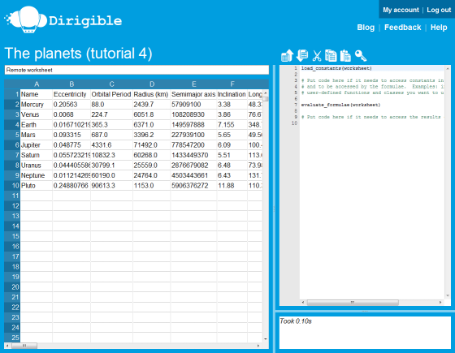
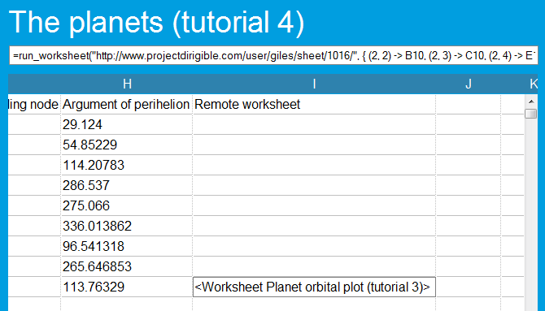
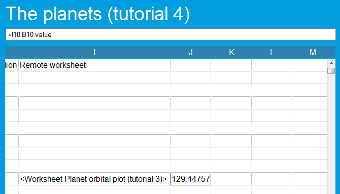
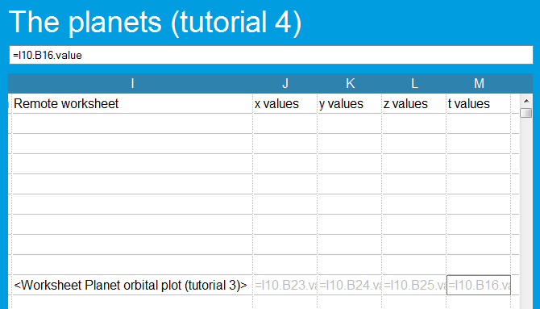
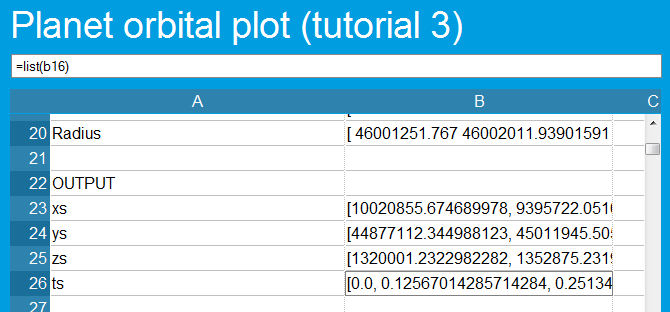
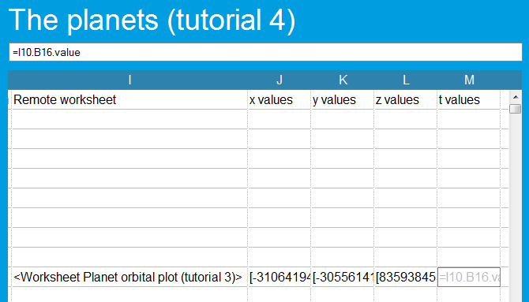
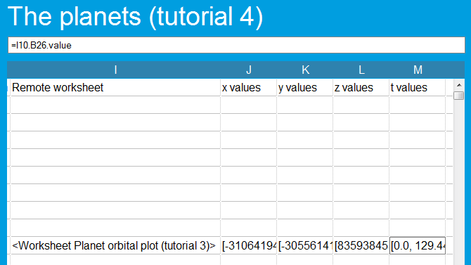
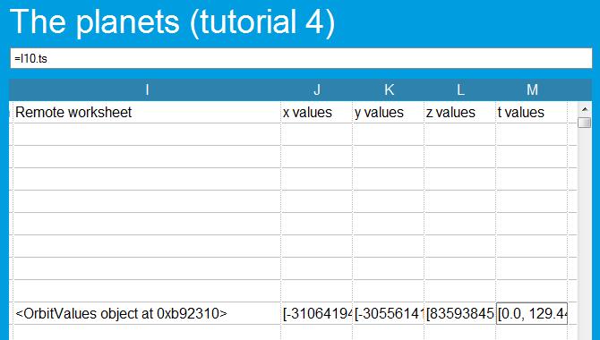
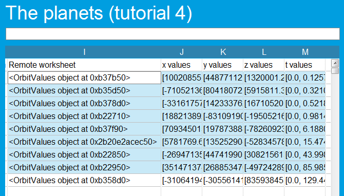

Tutorial part 4: Making your spreadsheets run in parallel
=========================================================

When you run a Dirigible spreadsheet, the Python code that is executed runs on specially-secured and programmed Internet servers.  The Dirigible network is made up of quite a number of these servers -- the exact number at any point depends on how busy our users are, as we scale up and down to match demand.  Normally, this is all transparent to you, but there is a way to use it to your advantage.

If you run several spreadsheets at the same time, then they will run on different servers -- so you basically have a number of computers working for you.   This means that if you have a problem that can be easily split up into different parts, each of which can be expressed as a separate spreadsheet, then you can run the different tasks in parallel and get the result you want faster.

Dirigible's :func:`run_worksheet` function makes this particularly easy, by allowing you to "call" one spreadsheet from another, in effect asking it to plug in certain starting values, to run itself, and to return a :class:`Worksheet` object containing the results.

In this part of the tutorial, we take the spreadsheet we created in :doc:`the last part <tutorial03>`, which calculated the orbit of the planet Mercury, and show how you can build another sheet that calls the first one nine times, to calculate the orbits of all of the planets (and Pluto) in little more time than it previously took to calculate just one.

We strongly recommend that you create your own sheet by working through this tutorial.

Loading some basic data
^^^^^^^^^^^^^^^^^^^^^^^

The first step is to get the basic orbital parameters -- the eccentricity, the orbital period, the semimajor axis, the inclination to the Sun's equator, the longitude of the ascending note and the argument of perihelion -- for each of the planets into a spreadsheet.  To save you from having to type these in, I've put them in a CSV file: `download it from here <https://s3.amazonaws.com/planet-data/all-planets.csv>`_, then create a new Dirigible worksheet, click on cell A1, and the "Import" button in the toolbar:

.. image:: tutorial-03-csv-import-button.png

Once the file's uploaded, adjust the column widths so that you can see the numbers, and give the sheet a name -- you'll end up with something like this:

The next step is to add formulae that will send these values off to our spreadsheet from last time for evaluation.

Introducing run_worksheet
^^^^^^^^^^^^^^^^^^^^^^^^^

The :func:`run_worksheet` function is simple to use, but very powerful.  It tells Dirigible to temporarily plug a set of values into another Dirigible spreadsheet, recalculate it, and return the results to you.  It's important to remember that it doesn't change the other spreadsheet while doing this -- the values you provide are temporary, and only used for the purposes of getting results from :func:`run_worksheet`.

It takes two arguments:

* The URL of the target worksheet -- that is, the one you want to delegate work to.  In this case, this will be the URL of the spreadsheet you created in the last tutorial, something like ``http://localhost:8000/user/your-username/sheet/some-number/``
* A dictionary of overrides -- the values you want to plug in to the other spreadsheet temporarily.  An example: ``{ (2, 3) : 25 }`` would tell :func:`run_worksheet` to override the original value of cell B3 with the value 23.

It returns a single object -- a :class:`Worksheet`, which you can access using the same methods as you would normally use with the built-in :const:`worksheet` variable when accessing it from usercode (for example, in the section :ref:`Generating formulae from usercode <generating-formulae>` in the first tutorial).

Using run_worksheet for one planet
^^^^^^^^^^^^^^^^^^^^^^^^^^^^^^^^^^

So, let's add a formula to use this to work out the orbital values for Pluto.  In cell I1, put "Remote worksheet" as a column header, and then in cell I10 enter the following formula (changing the URL appropriately):

::

  =run_worksheet("http://localhost:8000/user/your-username/sheet/some-number/", { (2, 2) -> B10, (2, 3) -> C10, (2, 4) -> E10, (2, 5) -> F10, (2, 6) -> G10, (2, 7) -> H10 })

Don't worry, we're going to tidy that up in a minute.  Once you've finished entering the formula, and once the "recalculating" animation next to the toolbar stops spinning, you should see something like this:

Cell I10 holds a worksheet object, which contains the results of plotting the orbit of the planet Pluto.  By default it just displays as something like ``<Worksheet worksheet-name>``.  To get the data out of it, we just need to treat it like a normal :class:`Worksheet`.  As an example, let's try pulling out the "Days/tick" value, which was in cell B10 in the other sheet.  Put ``=I10.B10.value`` into cell J10, and you should see something like this:

So, for Pluto to go 1/700th of its distant, slow orbit, it takes over 129 days.  That sounds about right.  So, the next step is obviously to start extracting the useful data from the other sheet: the the lists of *x*, *y*, *z* and *t* values that specify the orbital plot.  As you may remember, these are in cells B23, B24, B25, and B16 in the original orbital plot sheet.  Let's put the values for Pluto into columns J, K, L and M.

First, do the column headers:

* Set J1 to ``x values``.
* Set K1 to ``y values``.
* Set L1 to ``z values``.
* Set M1 to ``t values``.

Next, extract the lists of values from the :class:`Worksheet` object in I10.  These won't initially work, but it's instructive to see why:

* Set J10 to ``=I10.B23.value``.
* Set K10 to ``=I10.B24.value``.
* Set L10 to ``=I10.B25.value``.
* Set M10 to ``=I10.B16.value``.

You should see that the formulae don't evaluate to anything useful -- specifically, to the Python value ``None``. Dirigible will indicate this to you by showing the values in grey:

The reason for this lies in a detail of :func:`run_worksheet` -- it sends data between sheets using the `JSON format <http://www.json.org/>`_, which means that numbers, strings and simple lists are transferred transparently, but more complex data like Python objects, functions, and NumPy arrays need a little bit of help.  (This situation is likely to be improved in the future.)

So, for now, we need to alter our original sheet so that it produces objects that can be transferred over JSON.  Python lists of numbers are fine for this, so go **back to your sheet from the last tutorial**, and wrap ``list(...)`` around the formulae in cells B23, B24, and B25, so that (for example) B23 has a formula like this:

::

    =list(B20 * (math.cos(B12) * numpy.cos(B13 + B19) - math.sin(B12) * numpy.sin(B13 + B19) * math.cos(B11)))

Now, the formula in B16 used to calculate the values for *t* needs to remain a NumPy array, as otherwise the formulae below it wouldn't work.  So let's add a new row 26 to the outputs section at the bottom of the grid, where we list-ify the *t* values:

* Set A26 to ``ts``
* Set B27 to ``=list(b16)``

You should now have something like this:

Now, go back to your new sheet, hit refresh, and once the "recalculating" animation next to the toolbar stops spinning, you should get values for the *x*, *y* and *z* values:

Finally, adjust the formula in M10 to reflect the new position of the *t* values, setting it to ``=I10.B26.value``.  You should now have all of the data in your grid:

Scaling to nine planets
^^^^^^^^^^^^^^^^^^^^^^^

Now, we could just take the contents of cells I10:M10 and duplicate them across the equivalent columns for the other planets, and this would be easy with copy and paste.  But let's tidy things up a bit first.  The formula in cell I10 is particularly long and complicated, and it would be extremely annoying if it needed to be changed -- for instance, if the cells in our single-planet calculation sheet moved around.  Let's move it into usercode.  First, we put a function right at the start, above the default usercode, that will call :func:`run_worksheet` given the appropriate parameters, and will return an object that encapsulates the information we're interested in:

::

    class OrbitValues(object):
        def __init__(self, xs, ys, zs, ts):
            self.xs = xs
            self.ys = ys
            self.zs = zs
            self.ts = ts

    orbit_calculator_url = "http://localhost:8000/user/your-username/sheet/some-number/"
    def calculate_orbit(eccentricity, orbital_period, semimajor_axis, inclination, longitude_asc_node, arg_perihelion):
        worksheet = run_worksheet(
            orbit_calculator_url,
            {
                (2, 2): eccentricity,
                (2, 3): orbital_period,
                (2, 4): semimajor_axis,
                (2, 5): inclination,
                (2, 6): longitude_asc_node,
                (2, 7): arg_perihelion
            }
        )
        return OrbitValues(
            worksheet[2, 23].value,
            worksheet[2, 24].value,
            worksheet[2, 25].value,
            worksheet[2, 26].value,
        )

Once again, you'll need to replace the ``orbit_calculator_url`` with the URL of your spreadsheet from the previous tutorial; you can copy this from the formula in cell I10.

As you can see, this new usercode is little more than a tided-up, neatly-formatted version of the formula we had previously -- but it's much easier to read and maintain.  Next, we adjust the formula in cell I10 to use it:

::

  =calculate_orbit(B10, C10, E10, F10, G10, H10)

And finally, we change the formulae in cells J10:M10 to access the appropriate fields on our ``OrbitValues`` object

* Set J10 to ``=I10.xs``.
* Set K10 to ``=I10.ys``.
* Set L10 to ``=I10.zs``.
* Set M10 to ``=I10.ts``.

You'll wind up with something like this:

Now we've got a more-maintainable formula, let's copy and paste it.  Select cells I10:M10, hit Control-C (Command-C if you're on a Mac), then select A1:M9, and paste with Control/Command-V.  Wait for a few moments, and you should see the values filled in!

Even better, while it will probably have taken noticably longer to calculate the orbits of nine planets then it did to calculate one, it will not have taken nine times as long; depending on the current state of the Dirigible grid, it is likely to have taken between 1.5 and 3 times as long.

How does this work?
^^^^^^^^^^^^^^^^^^^

When Dirigible executes the :func:`evaluate_formulae` statement in your usercode to calculate results from the formulae that you've specified in the grid, it analyses your spreadsheet and works out which cells depend on which other cells.  It is able to use this information to work out which cells can be calculated in parallel.

So, because the various calls to :func:`run_worksheet` that are triggered via the ``calculate_orbit`` calls in cells I2:I10 do not depend on each other, Dirigible is able to run them all at the same time.  Because they are accessing another spreadsheet, each sub-calculation runs on a different machine within the Dirigible grid -- so for the duration of your spreadsheet's recalculation, you have up to ten computers working for you -- the one running the nine-planet sheet, and nine others running different versions of the single-planet sheet from the last part of the tutorial.

Dirigible's parallelisation of spreadsheet cell recalculation isn't tied to :func:`run_worksheet` -- any cells that can be run in parallel may be -- but it comes into its own when work can be offloaded to other computers like this.

In conclusion
^^^^^^^^^^^^^

In this part of the tutorial, we've worked through a spreadsheet that uses :func:`run_worksheet` to delegate multiple invocations of another spreadsheet to other computers, showing how you can easily re-use Dirigible spreadsheets from other Dirigible spreadsheets and benefit from scaling your calculations across the grid.  Our complete system of two spreadsheets uses just 13 formulae in the original single-planet sheet, then four formulae replicated nine times in the second, for a total of 13 + 36 = 49 formulae, all of which are pretty simple, and yet it produces a total of 25,200 numbers calculated by ten computers working in concert.

In the next tutorial (coming soon), we'll put this data to use, by writing a simple web page that extracts the data from the spreadsheet and displays it graphically.
